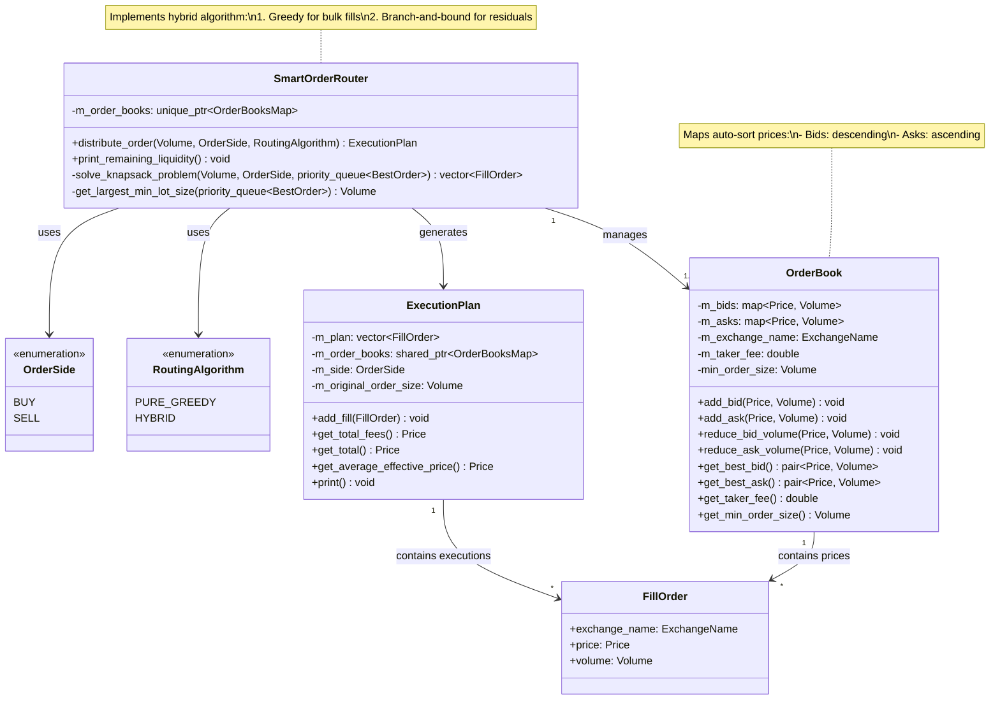

# Smart Order Router

## Требования
- Компилятор C++17 (GCC 9+, Clang 10+ или MSVC 2019+)
- CMake 3.10+
- Git

## Сборка проекта

```bash
# Клонировать репозиторий
git clone https://github.com/ARyakhovskiy/sor_prototype.git
cd sor_prototype

# Конфигурация (по умолчанию Debug-сборка)
cmake -B build -DCMAKE_BUILD_TYPE=Release 

# Компиляция
cmake --build build --parallel 4  # Можно изменить количество потоков

# Запуск
./build/smartorderrouter

При запуске программа предложит ввести размер ордера (положительный для BUY, отрицательный для SELL)
или одну из команд
lq - вывод на экран оставшейся ликвидности
exit - выход

# Тесты
./build/tests/order_book_tests
```

## Диаграмма Классов



# Описание Алгоритма

Алгоритм представляет собой комбинацию жадного алгоритма и метода ветвей и границ. Алгоритм строился с предположением о том, что размер любого исполняемой заявки должен быть кратен минимальному размеру заявки (МРЗ) на соответствующей бирже. Жадный алгоритм реализован при помощи `std::priority_queue<> best_orders`, которая содержит в себе "лучшие" (с наименьшей ценой для Buy-ордера, с наибольшей ценой для Sell-ордера) ценовые уровни с каждой из бирж. На каждом шаге алгоритм выполняет максимальный возможный (кратный МРЗ) объем из лучшей заявки в очереди. Если после этого полный объем ордера ещё не выполнен, то мы:

1. Удаляем верхнюю заявку из `priority_queue`
2. Удаляем соответствующую ей заявку в `std::map<> order_book` её биржи
3. Добавляем в `priority_queue` лучшую заявку из `order_book` той же биржи

Поскольку обе эти структуры автоматически отсортированы, то взятие и удаление максимального/минимального элемента происходит за O(1).

Жадный алгоритм продолжает работать, пока весь объем ордера не будет выполнен или в `order_book`-ах не закончатся заявки.

Основным преимуществом жадного алгоритма является его быстрота. Кроме того, если ордер выполнен жадным алгоритмом на 100%, то найденное решение оптимально. Поскольку ограничения на размер на минимальный размер заявки обычно:

1. Достаточно малы
2. Близки друг к другу

в большинстве случаев жадный алгоритм дает решение, близкое к оптимальному.

Для более строгого решения оптимизационной задачи мною был добавлен алгоритм, напоминающий по структуре метод ветвей и границ для задачи оптимального заполнения рюкзака. Алгоритм рекурсивно (с мемоизацией) перебирает варианты выполнения ордера, начиная с эвристики, полученной жадным методом. Переключение между алгоритмами происходит в тот момент, когда исполнение следующей заявки жадным алгоритмом снизит оставшийся объем заказа до уровня **НАИБОЛЬШЕГО** из минимальных объемов заявок всех бирж. Таким образом мы:

- Оставляем в рассмотрении заявки со всех бирж
- Значительно уменьшаем пространство поиска решения

Кроме того, пространство решений можно дополнительно ограничить, ограничивая количество рассматриваемых лотов с каждой биржи. Если суммарный объем заявок, добавленных с одной биржи в рассматриваемый набор, превышает оставшийся размер ордера, то заявки находящиеся на той же бирже ниже по приоритету, рассматривать не обязательно. Данный метод находит оптимальное решение для оставшегося объема ордера.

**Худший сценарий для производительности алгоритма**: среди бирж есть та, МРЗ которой во много (100+) раз больше других.

Такой гибридный метод **НЕ гарантирует** оптимальность в общем случае, однако обстоятельства, в которых найденное им решение не будет оптимальным, крайне экзотичны для приближенных к реальности сценариев. Балансом между близостью к оптимальному решению и быстродействием можно управлять, варьируя точку переключения методов.
